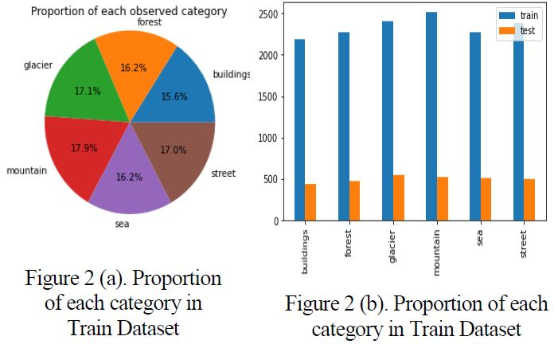
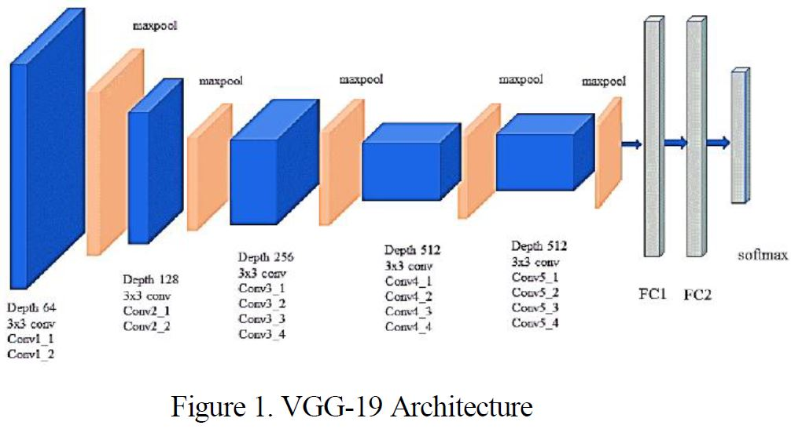
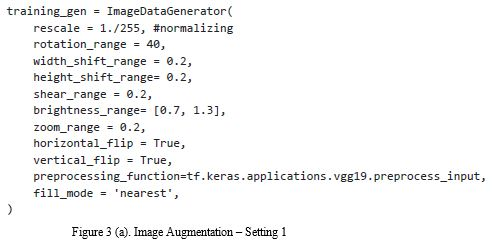
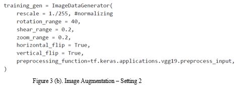
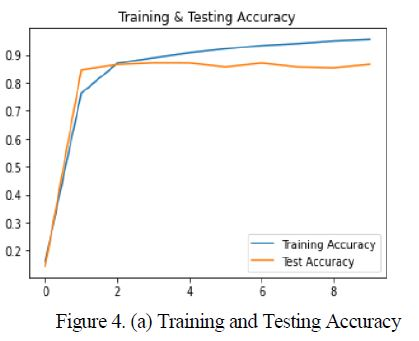
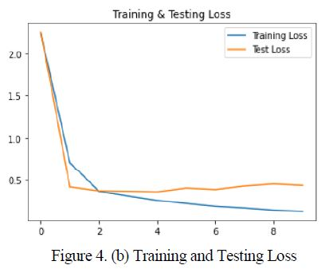
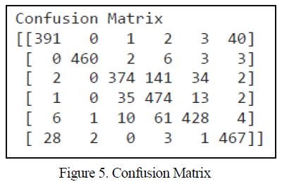
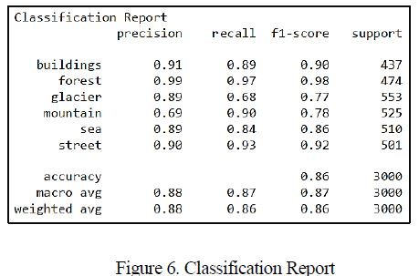
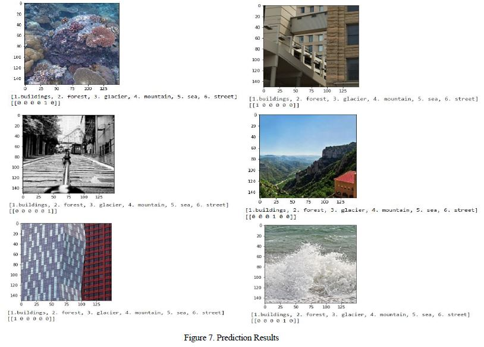

# ICCTL: Image Classification using CNNs and Transfer Learning
In this project one of the pre-trained models – VGG-19 with Convolutional Neural Network was used to classify images. Evaluation is performed on a publically available intel-image-classification dataset. This study shows that fine-tuning the pre-trained network with adaptive learning rate of 0.0001×epochs gives higher accuracy of 86.47% for image classification

## Dataset
Dataset can be downloaded from [Intel-Image-Classification.](https://www.kaggle.com/puneet6060/intel-image-classification/version/2)  
Intel-Image-Classification dataset consists of 150x150 images of 6 classes with 14034 training images, 3000 testing images and 7301 prediction images. Figure 2 (a) shows percentage of each category in training dataset and Figure.2 (b) shows a division of dataset into training and testing. 


Download the dataset and unzip them. The structure of the dataset should be like: 
```
intel-image-classification
|_ seg_pred
|  |_ <im-1-name>.jpg
|  |_ <im-2-name>.jpg
|  |_ ...
|_ seg_test
|  |_ buildings
|     |_ <im-1-name>.jpg
|     |_ ...
|  |_ forest
|     |_ <im-1-name>.jpg
|     |_ ...
|  |_ glacier
|     |_ <im-1-name>.jpg
|     |_ ...
|  |_ mountain
|     |_ <im-1-name>.jpg
|     |_ ...
|  |_ sea
|     |_ <im-1-name>.jpg
|     |_ ...
|  |_ street
|     |_ <im-1-name>.jpg
|     |_ ...
|_ seg_train
|  |_ buildings
|     |_ <im-1-name>.jpg
|     |_ ...
|  |_ forest
|     |_ <im-1-name>.jpg
|     |_ ...
|  |_ glacier
|     |_ <im-1-name>.jpg
|     |_ ...
|  |_ mountain
|     |_ <im-1-name>.jpg
|     |_ ...
|  |_ sea
|     |_ <im-1-name>.jpg
|     |_ ...
|  |_ street
|     |_ <im-1-name>.jpg
|     |_ ...
```

## Network Architecture
VGG-19 is used as a backbone architecture with pre-trained weights on ImageNet. Figure.1 shows the convolutional layer structure of VGG-19 architecture.  


## Running the Experiments
Experiments are done using with and without data augmentation. Following are the trained weights for different experiments, performed. Download the weights and then 
use `load_weights` method to load the pretrained weights and use them. 
* With Data Augmentation
  * [Setting-1](https://drive.google.com/file/d/1CsI1dsks5M60hdPMirtFJiMhYLKSFek8/view?usp=sharing) 
  * [Setting-2](https://drive.google.com/file/d/11wHduQ8I2ZHdMUgXCWrRr8qhVpuWcueV/view?usp=sharing)
  * [Setting-3](https://drive.google.com/file/d/1LwOuCZWzNuXWa5sHsFVLUTfkDx6Y0XIg/view?usp=sharing)
* Without Data Augmentation
  * [WithoutDataAugmentation](https://drive.google.com/file/d/1ctfcMu7IhE_2nZJapx82V6ICVJhBrbLH/view?usp=sharing) Note that these are the weights of `CV_Assignment_03.ipynb`. 
  
* Following are the snapshots of the three Settings for with-data-augmentation technique:
  *    
* `CV_Assignment_03.ipynb` is the file containing without-data-augmentation technique.

## Results

### Accuracy of different Experiments performed
The following table shows the accuracy obtained after carrying out the tests. It is evident that for Intel-Image-Classification dataset using VGG-19 architecture, 
with-out-data-augmentation gives higher accuracy of 86.47%. `CV_Assignment_03.ipynb` is the file containing without-data-augmentation technique.

| Method |Accuracy|
| --- | --- |
| Using Data Augmentation Setting 1 | 77.93% |
| Using Data Augmentation Setting 2 | 81.20% |
| Using Data Augmentation Setting 3 | 84.60% |
| Without Using Data Augmentation | 86.47% |

### Training and Testing Accuracy and Loss
Figure. 4 (a) and (b) shows Accuracy and Loss respectively over the epochs for the proposed model. It can be observed that the training accuracy is reaching gradually
to 95.47% and testing accuracy to 86.47%. Whereas, loss is gradually decreasing in each epoch over 10 epochs and then training stops due to early stopping. 

 

### Confusion Matrix & Classification Report
Figure.5 shows confusion matrix and Figure.6 shows classification report of the proposed model.





### Predictions
For Qualitative analysis Prediction data was used. Figure.6 shows some of the classification results using the proposed model.


